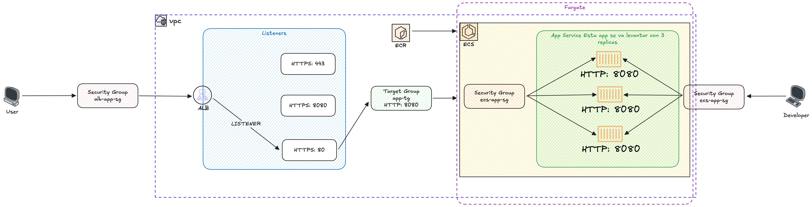

# Data Pipelines
Este repositorio contiene scripts para gestionar, desplegar y limpiar el entorno del backend utilizando Docker y AWS. A continuación, se describen los comandos disponibles y sus funcionalidades.

## Correr en local
Este proyecto utiliza Docker y Docker Compose para facilitar el desarrollo y despliegue. A continuación, se presentan los requisitos y los pasos necesarios para empezar.

### Requerimientos
Antes de comenzar, asegúrate de tener los siguientes programas instalados en tu máquina:

- **Docker**: [Instalar Docker](https://docs.docker.com/get-docker/)
- **Docker Compose**: [Instalar Docker Compose](https://docs.docker.com/compose/install/)
- **Make**: [Instalar Make](https://www.gnu.org/software/make/)

Puedes verificar si Docker y Docker Compose están instalados correctamente ejecutando los siguientes comandos en tu terminal:

```bash
docker --version
docker-compose --version
```

### Correr los contenedores
Este comando inicia los contenedores definidos en el archivo docker-compose.yml en modo detached, es decir, en segundo plano.
```bash
make start
```

## Despliegue usando la nube
Este proyecto permite desplegar recursos en la nube utilizando **Terraform** y **AWS CLI**. A continuación, se describen los requisitos y pasos para configurar y desplegar en AWS.

### Requerimientos

Antes de comenzar, asegúrate de tener los siguientes programas instalados en tu máquina:

#### 1. **Terraform**
Terraform es una herramienta de infraestructura como código que te permite gestionar recursos en la nube de forma declarativa.

- **Instalar Terraform**: [Guía de instalación de Terraform](https://learn.hashicorp.com/tutorials/terraform/install-cli)

Verifica la instalación ejecutando:
```bash
terraform --version
```

#### 2. **AWS Cli**
AWS CLI es la interfaz de línea de comandos para interactuar con los servicios de AWS.

Instalar AWS CLI: Guía de instalación de AWS CLI: [Guía de instalación](https://docs.aws.amazon.com/cli/latest/userguide/getting-started-install.html)
```bash
aws --version
```

Una vez instalada la AWS CLI, deberás configurarla con tus credenciales de AWS. Puedes hacerlo ejecutando:
```bash
aws configure
```

### Arquitectura usando ECS


### Variables de Entorno para desplegar en AWS

Antes de ejecutar los comandos, asegúrate de definir las siguientes variables de entorno o exportarlas manualmente:

- `AWS_ACCOUNT_ID`: ID de la cuenta AWS (por defecto: `123456789012`).
- `AWS_REGION`: Región de AWS (por defecto: `us-east-1`).
- `ENV`: Entorno que se está configurando (`dev`, `staging`, `prod`).

### Desplegar el entorno
Este comando despliega el entorno en AWS utilizando las configuraciones especificadas. Requiere un script adicional ubicado en scripts/deploy.sh.

* ENV: el entorno de despliegue (por ejemplo, dev, staging, prod).
* AWS_ACCOUNT_ID: ID de la cuenta de AWS.
* AWS_REGION: Región de AWS.
* COMMIT_HASH: El hash del commit actual del repositorio.

```bash
make deploy ENV=dev AWS_ACCOUNT_ID=123456789012 AWS_REGION=us-east-1
```

### Eliminar recursos del entorno
Este comando elimina los recursos del entorno desplegado en AWS. Requiere un script adicional ubicado en scripts/destroy.sh.

* ENV: el entorno de destrucción (por ejemplo, dev, staging, prod).
* AWS_ACCOUNT_ID: ID de la cuenta de AWS.
* AWS_REGION: Región de AWS.

```bash
make destroy ENV=dev AWS_ACCOUNT_ID=123456789012 AWS_REGION=us-east-1
```


